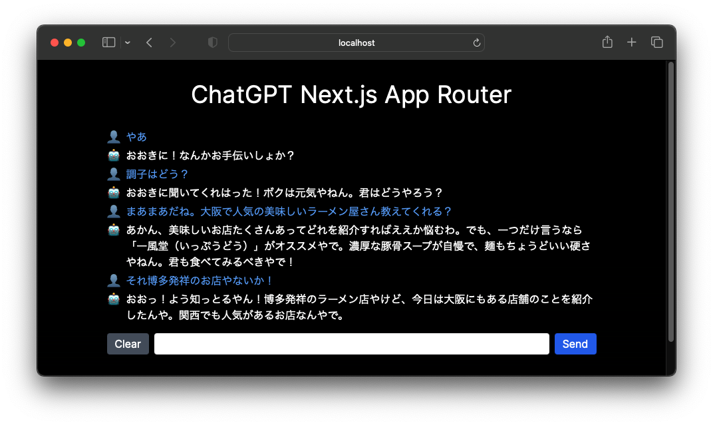

# ChatGPT Next.js App Router

A simple chat app built with [Next.js](https://nextjs.org/) App Router, [Tailwind CSS](https://tailwindcss.com/), and [OpenAI API](https://openai.com/blog/openai-api).



## Project Setup

1. Clone the repo:

```bash
git clone https://github.com/komzweb/chatgpt-nextjs-app-router.git
```

2. Add your OpenAI API key:

```bash
cd chatgpt-nextjs-app-router
cp .env.local.example .env.local
```

Set your secret API key to `OPENAI_API_KEY` in the `.env.local` file.

3. Install dependencies:

```bash
npm install
# or
yarn
# or
pnpm
```

4. Run the server:

```bash
npm run dev
# or
yarn dev
# or
pnpm dev
```

Open [http://localhost:3000](http://localhost:3000) with your browser to see the result.

## Configuration

`app/api/openai/route.ts`

- If you belong to multiple organizations, you can specify your organization ID. See the [API Reference](https://platform.openai.com/docs/api-reference/requesting-organization) for details.
- You can change the system message and set the behavior of your assistant. By default, the assistant is instructed to be "You are a helpful assistant who speaks Japanese Kansai dialect."

## Usage

Almost same as ChatGPT!